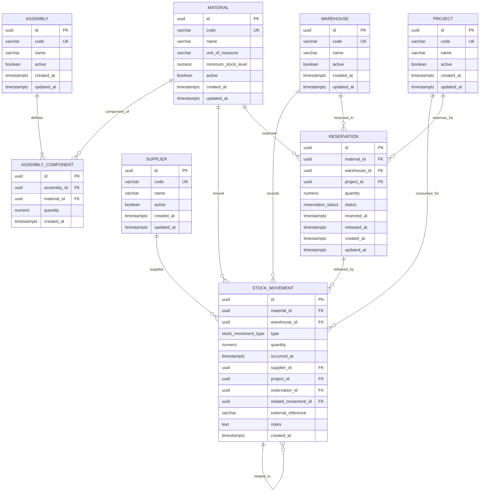

# Database

Use PostgreSQL.

Design normalized tables with indexes and foreign keys.

Use Flyway migrations.

Core tables:
- material
- warehouse
- stock_movement
- assembly
- assembly_component
- reservation
- supplier
- project

Create indexes for stock queries and movement history.

## Phase 2 schema design

### Design improvements over the initial proposal

The documented proposal intentionally lists only the core tables. The Phase 2 schema keeps those tables but adds the following production-oriented details:

- PostgreSQL enum types are used for movement and reservation statuses to keep valid values centralized and consistent with the domain model.
- Stock is not stored in `material`, `warehouse`, or any stock snapshot table. Current stock is calculated from `stock_movement.quantity` using the sign implied by `stock_movement.type`.
- BOM data is normalized through `assembly_component`, with one row per assembly/material pair and a positive required quantity.
- `stock_movement` includes optional source references (`supplier`, `project`, `reservation`, `related_movement`, `external_reference`) so entries, outputs, adjustments, and transfers can be audited without denormalizing stock.
- Transfers are represented as two movement rows, one `OUTGOING_TRANSFER` and one `INCOMING_TRANSFER`, linked by `related_movement_id`. This keeps stock calculation simple per warehouse and scales better than a polymorphic transfer table.
- Global unique constraints enforce stable business keys for master data and prevent ambiguity in user and integration lookups.

### Entity relationship explanation

- `material` stores catalogue components used in warehouses and BOMs. It owns no stock columns.
- `supplier` identifies suppliers that may be referenced by entry movements.
- `warehouse` identifies physical or logical storage locations.
- `project` identifies projects consuming or reserving materials.
- `assembly` represents a virtual product. Assemblies have no stock.
- `assembly_component` is the BOM line table. Each row links one `assembly` to one component `material` with the required quantity per assembly unit.
- `stock_movement` is the append-only inventory ledger. Every inventory change is recorded here and current stock is derived by summing signed quantities by material and warehouse.
- `reservation` reserves a positive quantity of a material in a warehouse for a project. Only `ACTIVE` reservations reduce availability.
- `stock_movement.reservation_id` can reference the reservation released by an output movement, preserving traceability between reservations and consumption.
- `stock_movement.related_movement_id` links transfer pairs or correction movements without changing the stock calculation model.

### Mermaid ER diagram

### Table definitions and column descriptions

Phase 3 adds Spring Data JPA auditing metadata to every persistent entity. In addition to the columns listed per table below, all tables include `created_by varchar(100)` and `updated_by varchar(100)`. The append-only design tables `assembly_component` and `stock_movement` also receive `updated_at timestamptz` so the reusable audited base mapping remains consistent across entities.

#### `material`

| Column | Type | Description |
| --- | --- | --- |
| `id` | `uuid` | Primary key. |
| `code` | `varchar(64)` | Stable catalogue code used by users and integrations. |
| `name` | `varchar(255)` | Human-readable material name. |
| `unit_of_measure` | `varchar(32)` | Unit used by quantities, for example `pcs`, `m`, or `kg`. |
| `minimum_stock_level` | `numeric(19,6)` | Non-negative alert threshold. Not current stock. |
| `active` | `boolean` | Whether the material can be used in new operations. |
| `created_at` | `timestamptz` | Creation timestamp. |
| `updated_at` | `timestamptz` | Last update timestamp. |

#### `supplier`

| Column | Type | Description |
| --- | --- | --- |
| `id` | `uuid` | Primary key. |
| `code` | `varchar(64)` | Stable supplier code. |
| `name` | `varchar(255)` | Supplier name. |
| `active` | `boolean` | Whether the supplier can be used in new operations. |
| `created_at` | `timestamptz` | Creation timestamp. |
| `updated_at` | `timestamptz` | Last update timestamp. |

#### `warehouse`

| Column | Type | Description |
| --- | --- | --- |
| `id` | `uuid` | Primary key. |
| `code` | `varchar(64)` | Stable warehouse code. |
| `name` | `varchar(255)` | Warehouse name. |
| `active` | `boolean` | Whether the warehouse can be used in new operations. |
| `created_at` | `timestamptz` | Creation timestamp. |
| `updated_at` | `timestamptz` | Last update timestamp. |

#### `project`

| Column | Type | Description |
| --- | --- | --- |
| `id` | `uuid` | Primary key. |
| `code` | `varchar(64)` | Stable project code. |
| `name` | `varchar(255)` | Project name. |
| `active` | `boolean` | Whether the project can be used in new operations. |
| `created_at` | `timestamptz` | Creation timestamp. |
| `updated_at` | `timestamptz` | Last update timestamp. |

#### `assembly`

| Column | Type | Description |
| --- | --- | --- |
| `id` | `uuid` | Primary key. |
| `code` | `varchar(64)` | Stable virtual assembly code. |
| `name` | `varchar(255)` | Assembly name. |
| `active` | `boolean` | Whether the assembly can be used in new operations. |
| `created_at` | `timestamptz` | Creation timestamp. |
| `updated_at` | `timestamptz` | Last update timestamp. |

#### `assembly_component`

| Column | Type | Description |
| --- | --- | --- |
| `id` | `uuid` | Primary key. |
| `assembly_id` | `uuid` | Assembly owning the BOM line. |
| `material_id` | `uuid` | Component material required by the assembly. |
| `quantity` | `numeric(19,6)` | Positive component quantity required per one assembly unit. |
| `created_at` | `timestamptz` | Creation timestamp. |

#### `stock_movement`

| Column | Type | Description |
| --- | --- | --- |
| `id` | `uuid` | Primary key. |
| `material_id` | `uuid` | Moved material. |
| `warehouse_id` | `uuid` | Warehouse affected by this ledger row. |
| `type` | `stock_movement_type` | Movement type and calculation sign. |
| `quantity` | `numeric(19,6)` | Positive movement quantity. Sign is derived from `type`. |
| `occurred_at` | `timestamptz` | Business timestamp of the inventory event. |
| `supplier_id` | `uuid` | Optional supplier for entry movements. |
| `project_id` | `uuid` | Optional project for outputs or project-driven adjustments. |
| `reservation_id` | `uuid` | Optional reservation consumed or released by the movement. |
| `related_movement_id` | `uuid` | Optional linked movement, mainly for transfer pairs. |
| `external_reference` | `varchar(128)` | Optional document, ERP, purchase order, or integration reference. |
| `notes` | `text` | Optional operational notes. |
| `created_at` | `timestamptz` | Creation timestamp. |

#### `reservation`

| Column | Type | Description |
| --- | --- | --- |
| `id` | `uuid` | Primary key. |
| `material_id` | `uuid` | Reserved material. |
| `warehouse_id` | `uuid` | Warehouse where material is reserved. |
| `project_id` | `uuid` | Project owning the reservation. |
| `quantity` | `numeric(19,6)` | Positive reserved quantity. |
| `status` | `reservation_status` | Current reservation status. |
| `reserved_at` | `timestamptz` | Business timestamp when the reservation was created. |
| `released_at` | `timestamptz` | Business timestamp when it was released or cancelled. |
| `created_at` | `timestamptz` | Creation timestamp. |
| `updated_at` | `timestamptz` | Last update timestamp. |

### Enums

#### `stock_movement_type`

| Value | Stock sign | Meaning |
| --- | ---: | --- |
| `ENTRY` | `+` | Material received into a warehouse. |
| `OUTPUT` | `-` | Material consumed or removed from a warehouse. |
| `POSITIVE_ADJUSTMENT` | `+` | Inventory correction increasing stock. |
| `NEGATIVE_ADJUSTMENT` | `-` | Inventory correction decreasing stock. |
| `INCOMING_TRANSFER` | `+` | Incoming side of a warehouse transfer. |
| `OUTGOING_TRANSFER` | `-` | Outgoing side of a warehouse transfer. |

#### `reservation_status`

| Value | Meaning |
| --- | --- |
| `ACTIVE` | Reservation currently reduces available stock. |
| `RELEASED` | Reservation was consumed or released and no longer reduces availability. |
| `CANCELLED` | Reservation was cancelled and no longer reduces availability. |

### Constraints

- All primary keys use `uuid` and default to `gen_random_uuid()`.
- Business codes are non-blank and globally unique per master table.
- Quantities use `numeric(19,6)` to avoid floating-point errors and support future fractional units.
- All quantities are constrained to non-negative or positive according to the domain rule.
- `assembly_component` has a unique `(assembly_id, material_id)` constraint to prevent duplicated BOM lines.
- `reservation.released_at` must be set when status is `RELEASED` or `CANCELLED`, and must be `null` when status is `ACTIVE`.
- Foreign keys use restrictive deletes to preserve inventory history and auditability.
- `stock_movement.related_movement_id` cannot point to itself.
- No table stores current stock or assembly availability.

### Indexes

- Unique indexes on `material.code`, `supplier.code`, `warehouse.code`, `project.code`, and `assembly.code` support fast lookup by business key.
- `idx_stock_movement_material_warehouse_occurred_at` supports stock aggregation and movement history per material and warehouse.
- `idx_stock_movement_warehouse_occurred_at` supports warehouse history screens.
- `idx_stock_movement_type_occurred_at` supports filtering by movement type and time windows.
- `idx_stock_movement_supplier_id`, `idx_stock_movement_project_id`, `idx_stock_movement_reservation_id`, and `idx_stock_movement_related_movement_id` support traceability queries.
- `idx_reservation_active_material_warehouse` is a partial index for active-reservation subtraction from available stock.
- `idx_reservation_project_status` supports project reservation views.
- `idx_assembly_component_assembly_id` supports loading BOMs.
- `idx_assembly_component_material_id` supports impact analysis when a material changes.
