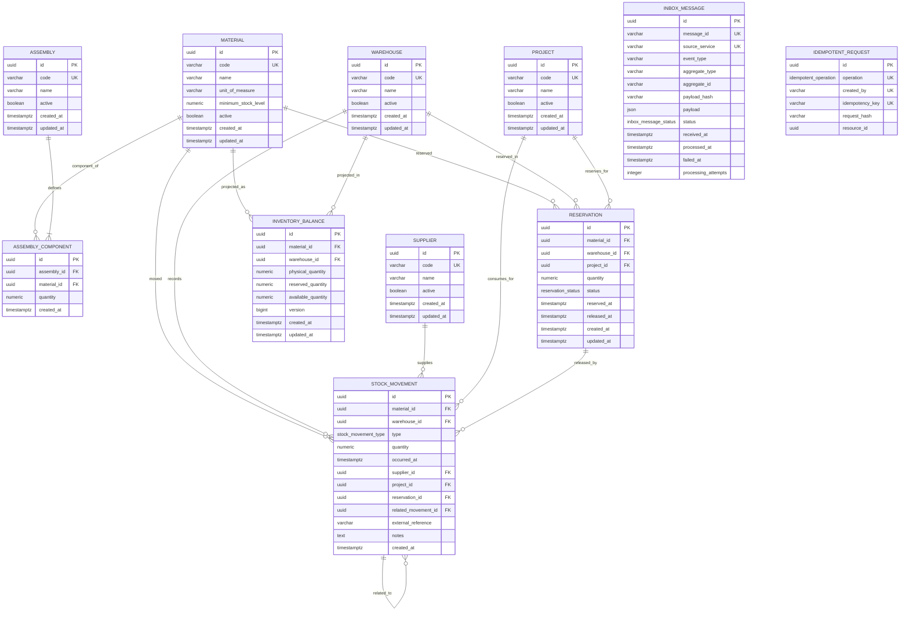

# Database

Use PostgreSQL.

Design normalized tables with indexes and foreign keys.

Use Flyway migrations.

Core tables:
- material
- warehouse
- stock_movement
- assembly
- assembly_component
- reservation
- supplier
- project

Create indexes for stock queries and movement history.

### What is actually in the database today

That list is the original proposal and stops at the core tables. The schema has grown since, always
through a Flyway migration — `ddl-auto` is `validate` in every profile, so an entity annotation alone
never changes anything:

| Migration | What it added |
| --- | --- |
| `V1__create_inventory_schema.sql` | The eight core tables and the two enums. |
| `V2__add_audit_user_columns.sql` | `created_by` / `updated_by` on all eight, plus the `updated_at` that `assembly_component` and `stock_movement` were missing. |
| `V3__add_inventory_balance_projection.sql` | `inventory_balance`, the `CONSUMED` reservation status, and the widened release-timestamp check. |
| `V4__create_inbox_message_table.sql` | `inbox_message` and `inbox_message_status`. |
| `V5__add_project_master_data_source.sql` | `project.source_service` / `source_entity_id`. |
| `V6__add_project_master_data_sequence.sql` | `project.source_sequence_number`. |
| `V7__add_envers_audit_tables.sql` | `audit_revision` and the seven `<table>_aud` twins. |
| `V8__create_idempotent_request_table.sql` | `idempotent_request` and `idempotent_operation`: the reservations and outputs written with an `Idempotency-Key`. |

A migration that changes a column on one of the seven audited tables has to change its `_aud` twin in
the same migration, or the application stops booting under `validate`.

## Phase 2 schema design

### Design improvements over the initial proposal

The documented proposal intentionally lists only the core tables. The Phase 2 schema keeps those tables but adds the following production-oriented details:

- PostgreSQL enum types are used for movement and reservation statuses to keep valid values centralized and consistent with the domain model.
- Stock is not stored in `material` or `warehouse`. The ledger `stock_movement` is the truth: every change is one signed row, and stock is what those rows add up to.
- What the ledger says is *also* kept in `inventory_balance`, a per material/warehouse projection added in `V3`. It is not a second source of truth but a cached one, rebuilt from the ledger and the active reservations in the migration that creates it, and maintained from then on by the same transaction that writes the movement or the reservation. Reads go to the projection so they never have to sum history; a check constraint keeps `available = physical - reserved` from drifting inside a row, and the conditional `UPDATE ... WHERE` idiom keeps two concurrent writers from overdrawing it.
- BOM data is normalized through `assembly_component`, with one row per assembly/material pair and a positive required quantity.
- `stock_movement` includes optional source references (`supplier`, `project`, `reservation`, `related_movement`, `external_reference`) so entries, outputs, adjustments, and transfers can be audited without denormalizing stock.
- Transfers are represented as two movement rows, one `OUTGOING_TRANSFER` and one `INCOMING_TRANSFER`, linked by `related_movement_id`. This keeps stock calculation simple per warehouse and scales better than a polymorphic transfer table.
- Global unique constraints enforce stable business keys for master data and prevent ambiguity in user and integration lookups.

### Entity relationship explanation

- `material` stores catalogue components used in warehouses and BOMs. It owns no stock columns.
- `supplier` identifies suppliers that may be referenced by entry movements.
- `warehouse` identifies physical or logical storage locations.
- `project` identifies projects consuming or reserving materials.
- `assembly` represents a virtual product. Assemblies have no stock.
- `assembly_component` is the BOM line table. Each row links one `assembly` to one component `material` with the required quantity per assembly unit.
- `stock_movement` is the append-only inventory ledger. Every inventory change is recorded here and current stock is derived by summing signed quantities by material and warehouse.
- `reservation` reserves a positive quantity of a material in a warehouse for a project. Only `ACTIVE` reservations reduce availability.
- `stock_movement.reservation_id` can reference the reservation released by an output movement, preserving traceability between reservations and consumption.
- `stock_movement.related_movement_id` links transfer pairs or correction movements without changing the stock calculation model.
- `inventory_balance` is the current-stock projection: one row per material/warehouse pair, holding what `stock_movement` and the `ACTIVE` reservations add up to. It is derived data with a unique key, not a relationship, so it hangs off `material` and `warehouse` and nothing points at it.
- `inbox_message` is not part of the inventory model at all. It records the master data messages this service has received from `mto-configuration` and what it did with each one, so a redelivery is applied at most once. It has no foreign key to anything: it describes traffic, not stock.
- `idempotent_request` is its REST counterpart: one row per reservation or output written with an `Idempotency-Key`, so a client that retries after losing the answer gets what the first request created instead of a second one. `resource_id` points at the reservation or at the movement depending on `operation`, which is why it has no foreign key.

### Mermaid ER diagram

```mermaid
erDiagram
    MATERIAL ||--o{ ASSEMBLY_COMPONENT : component_of
    ASSEMBLY ||--|{ ASSEMBLY_COMPONENT : defines
    MATERIAL ||--o{ STOCK_MOVEMENT : moved
    WAREHOUSE ||--o{ STOCK_MOVEMENT : records
    SUPPLIER ||--o{ STOCK_MOVEMENT : supplies
    PROJECT ||--o{ STOCK_MOVEMENT : consumes_for
    RESERVATION ||--o{ STOCK_MOVEMENT : released_by
    STOCK_MOVEMENT ||--o{ STOCK_MOVEMENT : related_to
    MATERIAL ||--o{ RESERVATION : reserved
    WAREHOUSE ||--o{ RESERVATION : reserved_in
    PROJECT ||--o{ RESERVATION : reserves_for
    MATERIAL ||--o{ INVENTORY_BALANCE : projected_as
    WAREHOUSE ||--o{ INVENTORY_BALANCE : projected_in

    MATERIAL {
        uuid id PK
        varchar code UK
        varchar name
        varchar unit_of_measure
        numeric minimum_stock_level
        boolean active
        timestamptz created_at
        timestamptz updated_at
    }

    SUPPLIER {
        uuid id PK
        varchar code UK
        varchar name
        boolean active
        timestamptz created_at
        timestamptz updated_at
    }

    WAREHOUSE {
        uuid id PK
        varchar code UK
        varchar name
        boolean active
        timestamptz created_at
        timestamptz updated_at
    }

    PROJECT {
        uuid id PK
        varchar code UK
        varchar name
        boolean active
        timestamptz created_at
        timestamptz updated_at
    }

    ASSEMBLY {
        uuid id PK
        varchar code UK
        varchar name
        boolean active
        timestamptz created_at
        timestamptz updated_at
    }

    ASSEMBLY_COMPONENT {
        uuid id PK
        uuid assembly_id FK
        uuid material_id FK
        numeric quantity
        timestamptz created_at
    }

    STOCK_MOVEMENT {
        uuid id PK
        uuid material_id FK
        uuid warehouse_id FK
        stock_movement_type type
        numeric quantity
        timestamptz occurred_at
        uuid supplier_id FK
        uuid project_id FK
        uuid reservation_id FK
        uuid related_movement_id FK
        varchar external_reference
        text notes
        timestamptz created_at
    }

    RESERVATION {
        uuid id PK
        uuid material_id FK
        uuid warehouse_id FK
        uuid project_id FK
        numeric quantity
        reservation_status status
        timestamptz reserved_at
        timestamptz released_at
        timestamptz created_at
        timestamptz updated_at
    }

    INVENTORY_BALANCE {
        uuid id PK
        uuid material_id FK
        uuid warehouse_id FK
        numeric physical_quantity
        numeric reserved_quantity
        numeric available_quantity
        bigint version
        timestamptz created_at
        timestamptz updated_at
    }

    INBOX_MESSAGE {
        uuid id PK
        varchar message_id UK
        varchar source_service UK
        varchar event_type
        varchar aggregate_type
        varchar aggregate_id
        varchar payload_hash
        json payload
        inbox_message_status status
        timestamptz received_at
        timestamptz processed_at
        timestamptz failed_at
        integer processing_attempts
    }

    IDEMPOTENT_REQUEST {
        uuid id PK
        idempotent_operation operation UK
        varchar created_by UK
        varchar idempotency_key UK
        varchar request_hash
        uuid resource_id
    }
```

`INBOX_MESSAGE` is drawn without a single relationship line on purpose: it has no foreign key to any
inventory table, because it records the messages that arrived and not the stock they moved. The same
goes for `IDEMPOTENT_REQUEST`, which records requests: its `resource_id` is a reservation or a
movement depending on the operation.

### Table definitions and column descriptions

Phase 3 adds Spring Data JPA auditing metadata to every persistent entity. In addition to the columns listed per table below, all tables include `created_by varchar(100)` and `updated_by varchar(100)`. The append-only design tables `assembly_component` and `stock_movement` also receive `updated_at timestamptz` so the reusable audited base mapping remains consistent across entities.

#### `material`

| Column | Type | Description |
| --- | --- | --- |
| `id` | `uuid` | Primary key. |
| `code` | `varchar(64)` | Stable catalogue code used by users and integrations. |
| `name` | `varchar(255)` | Human-readable material name. |
| `unit_of_measure` | `varchar(32)` | Unit used by quantities, for example `pcs`, `m`, or `kg`. |
| `minimum_stock_level` | `numeric(19,6)` | Non-negative alert threshold. Not current stock. |
| `active` | `boolean` | Whether the material can be used in new operations. |
| `created_at` | `timestamptz` | Creation timestamp. |
| `updated_at` | `timestamptz` | Last update timestamp. |

#### `supplier`

| Column | Type | Description |
| --- | --- | --- |
| `id` | `uuid` | Primary key. |
| `code` | `varchar(64)` | Stable supplier code. |
| `name` | `varchar(255)` | Supplier name. |
| `active` | `boolean` | Whether the supplier can be used in new operations. |
| `created_at` | `timestamptz` | Creation timestamp. |
| `updated_at` | `timestamptz` | Last update timestamp. |

#### `warehouse`

| Column | Type | Description |
| --- | --- | --- |
| `id` | `uuid` | Primary key. |
| `code` | `varchar(64)` | Stable warehouse code. |
| `name` | `varchar(255)` | Warehouse name. |
| `active` | `boolean` | Whether the warehouse can be used in new operations. |
| `created_at` | `timestamptz` | Creation timestamp. |
| `updated_at` | `timestamptz` | Last update timestamp. |

#### `project`

| Column | Type | Description |
| --- | --- | --- |
| `id` | `uuid` | Primary key. |
| `code` | `varchar(64)` | Stable project code. For a synchronized project it is derived as `EP-<source_entity_id>`, because an execution package publishes no code of its own and `code` is mandatory and unique. |
| `name` | `varchar(255)` | Project name. |
| `active` | `boolean` | Whether the project can be used in new operations. A project synchronized from a deleted execution package is deactivated, never deleted: `reservation` and `stock_movement` reference it with `on delete restrict`. |
| `source_service` | `varchar(100)` | Service the project came from (`mto-configuration`), or `NULL` when a person created it through the API. Added in `V5`. |
| `source_entity_id` | `varchar(100)` | Identifier of the entity it came from in that service. Together with `source_service` it is the key a later delivery of the same execution package is matched on — not `code`, which people read and write. Added in `V5`. |
| `source_sequence_number` | `bigint` | Watermark: the sequence number of the last master data change applied to this row, from the `sequenceNumber` header. A change that arrives below it is discarded, which is what stops a delayed `UPDATE` behind a `DELETE` from reactivating the project. `NULL` on projects created through the API. Added in `V6`. |
| `created_at` | `timestamptz` | Creation timestamp. |
| `updated_at` | `timestamptz` | Last update timestamp. |

The watermark is compared **inside** the `where` of the writing statement and never read first: between
a `select` and an `update` fit two deliveries. That is also why
`ProjectRepository.upsertFromMasterData` and `deactivateFromMasterData` are native SQL, and why a
`project` changed by a master data event leaves no Envers revision — see the `Project` gap in
`07-auditing.md`.

#### `assembly`

| Column | Type | Description |
| --- | --- | --- |
| `id` | `uuid` | Primary key. |
| `code` | `varchar(64)` | Stable virtual assembly code. |
| `name` | `varchar(255)` | Assembly name. |
| `active` | `boolean` | Whether the assembly can be used in new operations. |
| `created_at` | `timestamptz` | Creation timestamp. |
| `updated_at` | `timestamptz` | Last update timestamp. |

#### `assembly_component`

| Column | Type | Description |
| --- | --- | --- |
| `id` | `uuid` | Primary key. |
| `assembly_id` | `uuid` | Assembly owning the BOM line. |
| `material_id` | `uuid` | Component material required by the assembly. |
| `quantity` | `numeric(19,6)` | Positive component quantity required per one assembly unit. |
| `created_at` | `timestamptz` | Creation timestamp. |

#### `stock_movement`

| Column | Type | Description |
| --- | --- | --- |
| `id` | `uuid` | Primary key. |
| `material_id` | `uuid` | Moved material. |
| `warehouse_id` | `uuid` | Warehouse affected by this ledger row. |
| `type` | `stock_movement_type` | Movement type and calculation sign. |
| `quantity` | `numeric(19,6)` | Positive movement quantity. Sign is derived from `type`. |
| `occurred_at` | `timestamptz` | Business timestamp of the inventory event. |
| `supplier_id` | `uuid` | Optional supplier for entry movements. |
| `project_id` | `uuid` | Optional project for outputs or project-driven adjustments. |
| `reservation_id` | `uuid` | Optional reservation consumed or released by the movement. |
| `related_movement_id` | `uuid` | Optional linked movement, mainly for transfer pairs. |
| `external_reference` | `varchar(128)` | Optional document, ERP, purchase order, or integration reference. |
| `notes` | `text` | Optional operational notes. |
| `created_at` | `timestamptz` | Creation timestamp. |

#### `reservation`

| Column | Type | Description |
| --- | --- | --- |
| `id` | `uuid` | Primary key. |
| `material_id` | `uuid` | Reserved material. |
| `warehouse_id` | `uuid` | Warehouse where material is reserved. |
| `project_id` | `uuid` | Project owning the reservation. |
| `quantity` | `numeric(19,6)` | Positive reserved quantity. |
| `status` | `reservation_status` | Current reservation status. |
| `reserved_at` | `timestamptz` | Business timestamp when the reservation was created. |
| `released_at` | `timestamptz` | Business timestamp when it was released or cancelled. |
| `created_at` | `timestamptz` | Creation timestamp. |
| `updated_at` | `timestamptz` | Last update timestamp. |

#### `inventory_balance`

Added in `V3__add_inventory_balance_projection.sql`. One row per material/warehouse pair with the
current stock, so a read never has to sum `stock_movement` and `reservation` history. The migration
fills it from exactly those two tables, so the projection starts life agreeing with the ledger it
comes from.

| Column | Type | Description |
| --- | --- | --- |
| `id` | `uuid` | Primary key. |
| `material_id` | `uuid` | Projected material. |
| `warehouse_id` | `uuid` | Warehouse the quantities belong to. |
| `physical_quantity` | `numeric(19,6)` | What is on the shelf: the signed sum of this pair's movements. |
| `reserved_quantity` | `numeric(19,6)` | What `ACTIVE` reservations hold. |
| `available_quantity` | `numeric(19,6)` | `physical_quantity - reserved_quantity`, stored rather than computed so a query can filter on it, and held to that definition by a check constraint. |
| `version` | `bigint` | Optimistic-lock column, mapped `@Version`. Today nothing writes this row through JPA — every update is native — so the statements increment it by hand, which keeps it honest for whatever writes it that way later. |
| `created_at` | `timestamptz` | Creation timestamp. |
| `updated_at` | `timestamptz` | Last update timestamp. |

Every write goes through `InventoryBalanceRepository` as a conditional native
`UPDATE ... WHERE <the quantity is there>`, and the caller reads the row count: nothing is ever read
and then written back. The guard against overdrawing stock is therefore the `where` of that statement
and not a check in Java, which two concurrent deliveries would both pass.

The row is created lazily, by the `on conflict (material_id, warehouse_id) do nothing` insert that
precedes the first increase. So a material that has never entered a warehouse has no row there, and
its stock reads as zero through `coalesce`, not as a missing row.

#### `inbox_message`

Added in `V4__create_inbox_message_table.sql`. The consumer-side counterpart of the outbox
`mto-configuration` publishes with: the outbox guarantees a message is **published** at least once,
this table guarantees it is **applied** exactly once. Full detail in `06-messaging.md`.

| Column | Type | Description |
| --- | --- | --- |
| `id` | `uuid` | Primary key. |
| `message_id` | `varchar(200)` | Idempotency key: the envelope's `operationId`, or the AMQP `message_id` header when that is missing. Never truncated — two different identifiers cut to the same value would make a legitimate event look like a duplicate. |
| `source_service` | `varchar(100)` | Publisher (`origin` of the envelope). Part of the key so two publishers cannot collide on one identifier. |
| `event_type` | `varchar(150)` | Event type as published. |
| `aggregate_type`, `aggregate_id` | `varchar(150)`, `varchar(100)` | Entity and id that changed. |
| `exchange_name`, `routing_key`, `queue_name` | `varchar(255)` | Where the message came through. |
| `payload_hash` | `varchar(64)` | SHA-256 of the payload, for correlating and for spotting a redelivery whose content changed. Deliberately **not** the idempotency key: two legitimately identical events would hash the same. |
| `payload` | `json` | The JSON exactly as it arrived. `json` and not `jsonb`: `jsonb` reorders keys and collapses whitespace, so what is read back would no longer be what was received and would stop matching `payload_hash`. |
| `status` | `inbox_message_status` | Where the message got to. |
| `received_at` | `timestamptz` | When it was recorded. |
| `processed_at` | `timestamptz` | When it was applied. |
| `failed_at` | `timestamptz` | When it last failed. Kept even after a later success, as history. |
| `failure_reason` | `text` | Exception class and message of the last failure, truncated to 2000 characters by the service. |
| `processing_attempts` | `integer` | How many times the handler actually ran. A skipped duplicate does not increment it. |
| `created_at`, `updated_at` | `timestamptz` | Row timestamps. |

The guarantee is `uq_inbox_message_message_id_source`, not any check in code: `InboxMessageRepository`
claims and marks with conditional native `UPDATE`s and an `on conflict` insert — the same idiom as
`inventory_balance` — because a read-then-write lets two concurrent deliveries through.

#### `idempotent_request`

Added in `V8__create_idempotent_request_table.sql`. The writes made with an `Idempotency-Key`
(`POST /reservations` and `POST /movements/outputs`, see `04-rest-api.md`): a client that retries after
losing the answer gets what the first request created instead of reserving or taking the material out
a second time.

| Column | Type | Description |
| --- | --- | --- |
| `id` | `uuid` | Primary key. |
| `operation` | `idempotent_operation` | Which write. Each one has its own key space. |
| `idempotency_key` | `varchar(255)` | The header as it arrived: 1 to 255 visible ASCII characters. |
| `request_hash` | `varchar(64)` | SHA-256 of the request body (every field that is set, decimals by value). The same key with another body is rejected with `409 IDEM-001`. |
| `resource_id` | `uuid` | The reservation or the movement the request created. Null only inside the transaction that claims the key, which never commits without it. |
| `created_at`, `updated_at` | `timestamptz` | Row timestamps. |
| `created_by`, `updated_by` | `varchar(100)` | Who sent the request — the authenticated user, as in every other table. `created_by` is part of the key, so one client's key never collides with another's. |

The guarantee is `uq_idempotent_request_key`, not any check in code. The write claims its key with an
`on conflict do nothing` insert at the start of its own transaction and records what it created at
the end. A second request with the same key does not see the first one's uncommitted row but waits on
the unique index until that transaction ends: if it committed, the insert does nothing and the stored
row answers; if it rolled back (stock said no), the claim went with it and the retry runs as if it were
the first. Rows do not expire: there is one per keyed write, the same order of magnitude as the ledger.

### Enums

#### `stock_movement_type`

| Value | Stock sign | Meaning |
| --- | ---: | --- |
| `ENTRY` | `+` | Material received into a warehouse. |
| `OUTPUT` | `-` | Material consumed or removed from a warehouse. |
| `POSITIVE_ADJUSTMENT` | `+` | Inventory correction increasing stock. |
| `NEGATIVE_ADJUSTMENT` | `-` | Inventory correction decreasing stock. |
| `INCOMING_TRANSFER` | `+` | Incoming side of a warehouse transfer. |
| `OUTGOING_TRANSFER` | `-` | Outgoing side of a warehouse transfer. |

#### `reservation_status`

| Value | Meaning |
| --- | --- |
| `ACTIVE` | Reservation currently reduces available stock. It is the only value that does. |
| `RELEASED` | Reservation was given back without the material leaving the warehouse. `reserved` drops, `physical` does not. |
| `CANCELLED` | Reservation was cancelled. Same effect on stock as `RELEASED`; the difference is why, and it is worth keeping apart in the history. |
| `CONSUMED` | The material actually left against this reservation. Both `reserved` and `physical` drop. Added in `V3`, which is also what split it from `RELEASED`. |

This type is reused by `reservation_aud.status`, so any future `ALTER TYPE` affects both tables.

#### `inbox_message_status`

| Value | Meaning |
| --- | --- |
| `RECEIVED` | Recorded on arrival, not claimed yet. |
| `PROCESSING` | Claimed by one delivery. The claim is conditional, so a second concurrent delivery finds nothing to claim and skips the handler. |
| `PROCESSED` | Applied. An event whose entity has no handler ends up here too: what to do with it was decided — nothing — and redelivering it would not change that. |
| `FAILED` | The handler threw. Written by `recordFailure` in its own `REQUIRES_NEW` transaction, because the attempt's transaction has to roll back and would take the mark with it. |

#### `idempotent_operation`

| Value | Meaning |
| --- | --- |
| `RESERVATION` | `POST /reservations`; `resource_id` is the reservation. |
| `OUTPUT` | `POST /movements/outputs`; `resource_id` is the output movement. |

### Audit tables (Hibernate Envers)

`V7__add_envers_audit_tables.sql` adds the change history. `audit_revision` replaces the `REVINFO`
table Envers would create on its own, and seven `<table>_aud` twins hold the state of each audited
entity at each revision. Full rationale — including what is deliberately **not** audited and why — is
in `07-auditing.md`.

#### `audit_revision`

One row per transaction that changed an audited entity.

| Column | Type | Description |
| --- | --- | --- |
| `id` | `integer` | Revision number, from `audit_revision_seq`. Shared by every entity changed in the same transaction. |
| `timestamp` | `bigint` | Epoch milliseconds. Not `timestamptz`: this is the type `@RevisionTimestamp` accepts on every Envers version. |
| `username` | `varchar(100)` | The same actor as `updated_by`; may be `system` or `unknown`. |
| `user_id` | `varchar(100)` | Token `sub`, which survives a rename in Keycloak. |
| `source` | `varchar(20)` | `HTTP`, `MESSAGING`, `SYSTEM` or `BASELINE`. Says which identifier space `correlation_id` belongs to. |
| `correlation_id` | `varchar(200)` | `X-Correlation-Id` header, or the RabbitMQ message id. |
| `ip_address` | `varchar(100)` | First `X-Forwarded-For` hop; behind the gateway `getRemoteAddr()` would be the gateway. |
| `user_agent` | `varchar(500)` | HTTP path only. |
| `request_method` | `varchar(20)` | HTTP path only. |
| `request_uri` | `varchar(500)` | HTTP path only. |

Revision `1` is the baseline written by the migration itself: a snapshot of every row that existed
when history started being kept. It is marked `source = 'BASELINE'` because it is not a creation
event.

#### `<table>_aud`

Seven twins: `material_aud`, `supplier_aud`, `warehouse_aud`, `project_aud`, `assembly_aud`,
`assembly_component_aud`, `reservation_aud`.

Each carries `id uuid`, `rev integer`, `revtype smallint` (`0` add, `1` modify, `2` delete) and the
business columns of its base table — **not** the four audit-metadata columns, which live once per
revision in `audit_revision` instead of being repeated per row.

`reservation_aud.status` is the native `reservation_status` enum, the same type as the base table:
the entity maps it with `@JdbcTypeCode(SqlTypes.NAMED_ENUM)`, so a `varchar` here would fail
`ddl-auto: validate` and stop the application from booting.

### Constraints

- All primary keys use `uuid` and default to `gen_random_uuid()`.
- Business codes are non-blank and globally unique per master table.
- Quantities use `numeric(19,6)` to avoid floating-point errors and support future fractional units.
- All quantities are constrained to non-negative or positive according to the domain rule.
- `assembly_component` has a unique `(assembly_id, material_id)` constraint to prevent duplicated BOM lines.
- `reservation.released_at` must be set for every status other than `ACTIVE`, and must be `null` when status is `ACTIVE`. `V3` widened this from an explicit `RELEASED`/`CANCELLED` list when it added `CONSUMED`, so a future status cannot slip past it.
- Foreign keys use restrictive deletes to preserve inventory history and auditability.
- `stock_movement.related_movement_id` cannot point to itself.
- `inventory_balance` has a unique `(material_id, warehouse_id)` constraint — it is what makes the `on conflict do nothing` insert safe — and three non-negative checks plus `chk_inventory_balance_available_matches_quantities`, which pins `available_quantity = physical_quantity - reserved_quantity`. A projection that could drift from its own definition would be worse than no projection.
- `inbox_message` has a unique `(message_id, source_service)` constraint. It is the whole idempotency guarantee, so it belongs in the schema and not in Java.
- `idempotent_request` has a unique `(operation, created_by, idempotency_key)` constraint, for the same reason: it is the idempotency guarantee of the REST writes. `chk_idempotent_request_key_not_blank` keeps an empty key out.
- `inbox_message` status timestamps are one-way implications, not equivalences: `PROCESSED` requires `processed_at` and `FAILED` requires `failed_at`, but a message that failed and was later reprocessed stays `PROCESSED` and keeps its `failed_at` as history.
- `project` requires `source_service` and `source_entity_id` either both set or both null (`chk_project_source_columns_together`), and `uq_project_source` makes the pair unique. A half-filled row would be inserted again on the next delivery instead of updated. `source_sequence_number` cannot be set without a `source_service`.
- No table stores assembly availability; it is always computed from the BOM against component stock.
- `inventory_balance` is the one table that stores current stock, and it is a projection: derived from `stock_movement` and the active reservations, rebuildable from them, and never the thing that is corrected by hand.
- The `_aud` twins carry no `CHECK`, no `UNIQUE` and no foreign key to their base table: a history row records states that were valid at the time, and must outlive the row it describes. Their only foreign key is `rev` to `audit_revision`, and every business column is nullable because a deletion row writes nulls.

### Indexes

- Unique indexes on `material.code`, `supplier.code`, `warehouse.code`, `project.code`, and `assembly.code` support fast lookup by business key.
- `idx_stock_movement_material_warehouse_occurred_at` supports stock aggregation and movement history per material and warehouse.
- `idx_stock_movement_warehouse_occurred_at` supports warehouse history screens.
- `idx_stock_movement_type_occurred_at` supports filtering by movement type and time windows.
- `idx_stock_movement_supplier_id`, `idx_stock_movement_project_id`, `idx_stock_movement_reservation_id`, and `idx_stock_movement_related_movement_id` support traceability queries.
- `idx_reservation_active_material_warehouse` is a partial index for active-reservation subtraction from available stock.
- `idx_reservation_project_status` supports project reservation views.
- `idx_assembly_component_assembly_id` supports loading BOMs.
- `idx_assembly_component_material_id` supports impact analysis when a material changes.
- `idx_inventory_balance_material_id`, `idx_inventory_balance_warehouse_id` and `idx_inventory_balance_material_warehouse` support the three shapes of stock read: one material everywhere, one warehouse's inventory, and the exact pair every conditional balance update goes through.
- `idx_inbox_message_status_received_at` and `idx_inbox_message_received_at` support the operational queries — "what failed", "what arrived in this window". There is deliberately **no** standalone index on `message_id`: `uq_inbox_message_message_id_source` already indexes it as the leading column, and an extra one would only make every insert dearer on a table that takes one insert per incoming message.
- `idempotent_request` has no index of its own: the only lookup is by the full key, which `uq_idempotent_request_key` already indexes.
- `idx_<table>_aud_id_rev` on each audit twin supports the query that is actually made — "history of this entity" — which filters on `id`, while the primary key `(rev, id)` leads with `rev`.
- `idx_audit_revision_timestamp`, `idx_audit_revision_username` and the partial `idx_audit_revision_correlation_id` support auditing queries by time, author and correlation.
